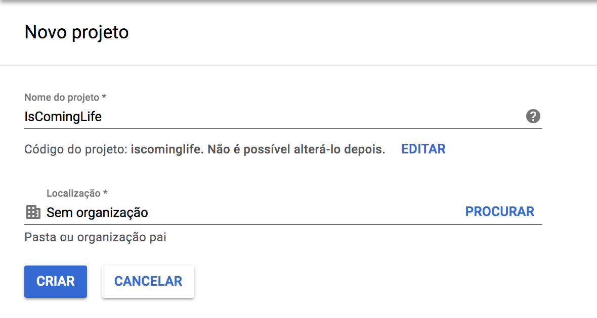

# Criando um projeto

Se você está lendo esse arquivo, provavelmente decidiu aprender um pouco sobre GCP (Google Cloud Plataform) e veio ao local certo. Apesar de desde já recomendarmos a leitura da documentação oficial, que é muito boa, vamos tentar te mostrar como cada coisa funciona na pratica. 

Todos os problemas encontrados durante a criação desse "curso", vão ser mapeados e explicados aqui... Então caso encontre algum novo cria uma issue e conta pra gente que vamos resolver e documentar aqui...

Vamos parar de bla bla bla e ir pra parte prática! :)

# Criando a conta

Caso você ainda não tenha uma, basta [criar uma conta no google](https://accounts.google.com/signup/v2/webcreateaccount?service=cloudconsole&continue=https%3A%2F%2Fconsole.cloud.google.com%2Ffreetrial%3F_ga%3D2.149937840.-701438888.1538356467%26ref%3Dhttps%3A%2F%2Fcloud.google.com%2F&flowName=GlifWebSignIn&flowEntry=SignUp&nogm=true).

Caso já possua uma conta, entre no site do [google cloud](https://cloud.google.com/) e faca login para uma avaliação gratuita. 
O GCP te da um valor de bônus, nesse momento 300$, e também te oferece o free tier que são opções de maquinas que estão grátis para sempre!

# Criando um projeto

Com a sua conta já criada vamos dar uma olhada na tela de criação de projeto.

Nessa página já temos algumas coisas que requerem um pouco de atenção:

### Nome do Projeto

Esse nome e basicamente um apelido. E pode ser alterado a qualquer momento.

### Código do projeto

Esse e realmente o identificador único do projeto.
O Google cloud vai tentar cadastrar o nome mais parecido possível com seu projeto, no nosso caso conseguimos utilizar o mesmo nome do projeto, mas isso não e uma regra. 
Esse código não pode ser alterado e será utilizado na hora configurar o SDK.

### Organização

TODO

### Próximos passos

Apos clicar em criar vai levar alguns segundos (talvez minutos) para que o projeto fique disponível pra você.

Aguarde um pouco...

Um pouco mais...

Ok, já deve ter finalizado...

Agora podemos seguir!

Vamos conhecer o gcloud sdk e daqui pra frente tentaremos sempre fazer das duas formas.
Tanto pela UI quanto pela linha de comando.
