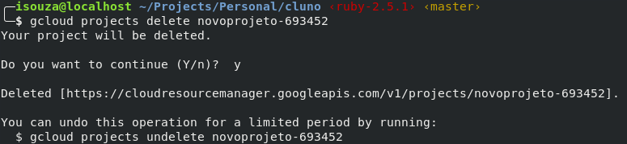
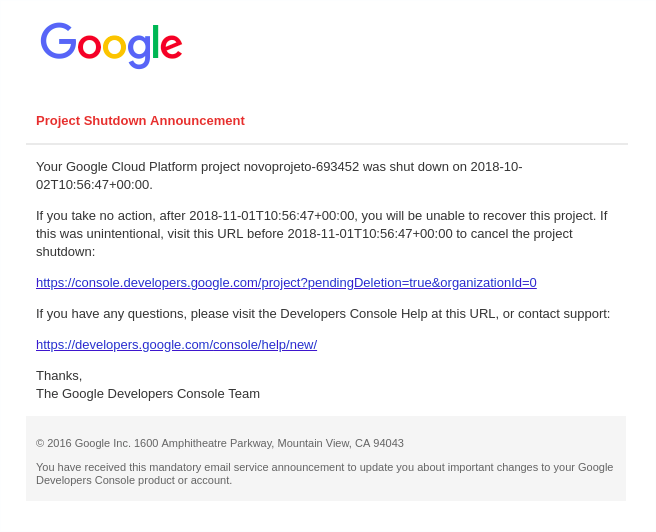

# Conhecendo o SDK

### Instalando


### MacOS

Vamos utilizar o brew:

```
brew tap caskroom/cask
brew cask install google-cloud-sdk
```

Para validar se o gcloud foi instalado com sucesso execute o seguinte comando:

```
gcloud --version
```

Ele deve te retornar algo como:


## Windows 

Certifique-se que o Python está instalado na sua máquina corretamente.

Faça o download do [Instalador do Google Cloud SDK](https://dl.google.com/dl/cloudsdk/channels/rapid/GoogleCloudSDKInstaller.exe).

Inicie o instalador e siga as instruções.

Depois que a instalação for concluída, o instalador apresenta várias opções:


Verifique se as opções abaixo estão selecionadas:

 * Start Google Cloud SDK Shell (Iniciar Shell do Google Cloud SDK)
 * Run 'gcloud init' (Executar 'gcloud init')
 * O instalador abre uma janela de terminal e executa o comando gcloud init.

Dica de solução de problemas: caso sua instalação não tenha sucesso devido a uma falha de reconhecimento do comando find, verifique se a variável de ambiente PATH está configurada para incluir a pasta que contém find. Normalmente, é a `C:\WINDOWS\system32`;.


## Linux

Antes de começar
Verifique se o sistema operacional é um dos seguintes itens:

 * uma versão do Ubuntu que não atingiu o fim da vida útil
 * uma versão estável do Debian a partir da Wheezy
 
 Em seguida, realize as seguintes etapas:

* Criar variável de ambiente para distribuição correta
```
export CLOUD_SDK_REPO="cloud-sdk-$(lsb_release -c -s)"
```

* Adicione o URI de distribuição do Cloud SDK como uma fonte de pacote
```
echo "deb http://packages.cloud.google.com/apt $CLOUD_SDK_REPO main" | sudo tee -a /etc/apt/sources.list.d/google-cloud-sdk.list
```
* Importar a chave pública do Google Cloud Platform
```
curl https://packages.cloud.google.com/apt/doc/apt-key.gpg | sudo apt-key add -
```

* Atualize a lista de pacotes e instale o Cloud SDK
```
sudo apt-get update && sudo apt-get install google-cloud-sdk
```

###


### Configurando o gcloud

Comece executando o comando 

```
gcloud init
```

e siga o passo a passo.

* De um nome para a configuracao
* Faca login com sua conta do google
* Escolha o projeto criado ou crie um novo

E isso, agora voce ja tem seu projeto cadastrado e podemos comecar a utilizar a cli (command line interface) para executar nossos comandos!


### Criando um projeto pela sdk

A primeira dica vai pro comando `man`, muito provavelmetne voce nao conhece os parametros de nenhum comando do gcloud. Entao voce vai precisar bastante do `man`. 

Faca o seguinte digito o comando `man gcloud` e aperta tab. 
Voce deve estar vendo uma lista gigante de comandos. Mas nos queremos ver comandos relacionados a projetos, entao vamos tentar reduzir essa lista executando `man gcloud_projects` e prescionando tab novamente.
Beleza, agora temos uma lista bem menor...

Voce consegue ate ler as opcoes, e ver que temos uma que e create. 
Seguimos com o comando `man gcloud_projects_create`.
De uma lida em como o comando funciona e todos os parametros.

Caso voce nao queira ler agora, basta digital `gcloud projects create $id_unico`, trocando $id_unico para o id do seu projeto. 


Nao vamos precisar desse projeto, pois ja criamos o nosso anteriormente.
Entao vamos aproveitar para aprender a deletar um projeto.

Supondo que a gente nao saiba o id do projeto, nem quais projetos existem podemos simplesmente rodar o comando `gcloud projects list`


Agora que sabemos os projetos existentes podemos deletar com `gcloud projects delete $id_unico`



Se voce ler com atencao a saida do comando vai aprender mais um novo comando:

`gcloud projects undelete $id_unico`

Por padrao a GCP nao deleta instanteneamente seu projeto, ele joga o projeto em uma especie de quarentena que dura em torno de 30 dias. Quando esse prazo vai chegando ao final, eles enviam um email para voce falando que seu projeto sera deletado em breve.

Ate esse dia voce pode desfazer o comando de delete e recuperar o projeto.

Vale a pena mencionar que voce recebera um email, assim que mandar deletar o projeto, avisando que foi agendado a delecao do projeto.




# Links uteis
- https://cloud.google.com/sdk/gcloud/reference/

