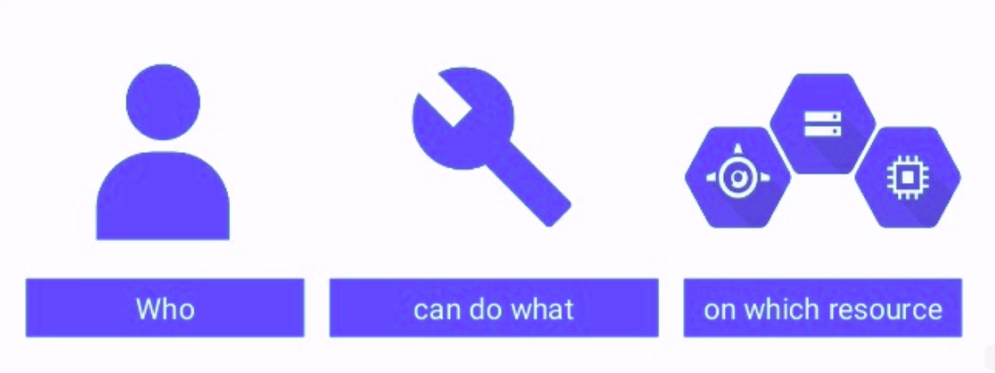
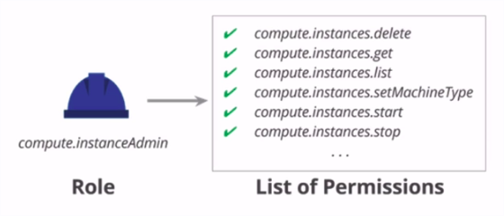
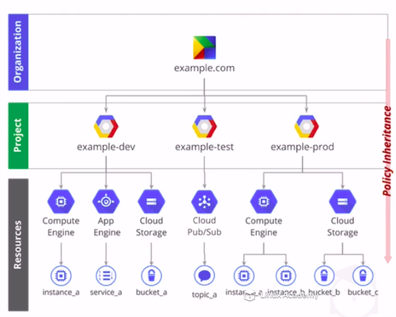

# IAM - Identity and Access Management (vulgo quem pode acessar oq)

A nao ser que voce tenha um time muito maduro e trabalhe numa empresa que abraca o caos todos os dias pela manha, voce (na verdade seu gestor) vai se preocupar bastante com o fato de quem tem permissao para criar, acessar e usar determinados servicos ou projetos.

Uma dica e utilize sempre o principio do menor privilegio possivel. 
O que isso quer dizer?
Se voce precisar criar um usuario com permissao para VER algo, busque uma maneira dele ter APENAS a possibilidade de VER. Nao libere acesso de ADMIN para essa pessoa, pois isso pode acarretar em diversos problemas. (Se quiser que explique com mais detalhes abre uma issue ai que eu detalho melhor!)

O google separa os usuarios em 2 grupos principais.

* Pessoas
  * Conta do Google
  * Grupo do google
  * Dominio do G Suite
  * Cloud Identity Domain
    * E um tipo de dominio da organizacao e nao necessariamente um dominio do Google.
* Conta de servico

## Conta de Servico

Esse tipo de conta e extremamente indicado para, pasme, servicos. Se voce tem um servico de backup por exemplo, crie um usuario de servico e utilize ele para que a aplicacao se conecte ao outro servico.

"A mais eu uso a minha propria conta e nao deu nenhum problema!"  (Ops, Dev)

Sim, e provavelmente isso nunca vai ser um problema para voce, mas sera um grande problema para os amiguinhos que ficarem quando voce sair da empresa ou precisar se afastar e por medidas de seguranca desativarem seu usuario. :)

Por padrao esse usuarios de servico seguem o seguinte formato:

`<project_number>@developer.gserviceaccount.com`

# Roles

Role nada mais e que um conjunto de permissoes.

O primeiro ponto possitivo de usar uma role e ter facilidade em passar as mesmas permissoes para um novo usuario que acabou de entrar na empresa.

Ai voce que esta apenas estudando pode pensar:

"nao vou criar role, nao tem necessidade no meu caso"

Mas voce esta enganado, na GCP voce nao pode anexar permissoes a usuarios. Usuarios podem ter apenas roles anexadas a eles. 

As permissoes seguem um padrao de `$servico.$recurso.$verbo`, por exemplo `compute.instances.delete`!

# Politicas de IAM

As politicas de hierarquia da GCP sao bem granulares e funcionam de cima pra baixo (nesse desenho pelo menos).

Vamos imaginar o seguinte, Bianca acabou de chegar na empresa e vai fazer parte do projeto `example-dev`. No entanto ela so vai precisar de acesso ao `Compute Engine`, nao precisa se preocupar em saber detalhes mas a titulo de curiosidade sao as VMs na GCP, mas somente para *visualizar*. 

Voce como uma pessoa que conhece o principio do menor privilegio vai liberar para ela apenas a *visualizacao* do recurso `Compute Engine`.

Depois que voce foi pra casa, Bianca percebeu que precisa tambem ter acesso ao `Cloud Storage` para validar algumas coisas.
Uma pessoa mais desatualizada recebeu essa solicitacao e apos ver que ela ja tinha acesso ao `Compute Engine` resolveu liberar acesso de *Admin* ao projeto.

Liberar esse tipo de acesso ao projeto tem efeito em todos os recursos abaixo, mas... como voce acha que ficariam as permissoes da Bianca no `Compute Engine`?

Obviamente ela teria acesso de *Admin* no `App Engine` e `Cloud Storage` mas manteria o de *Viewer* no `Compute Engine` correto?

Nope! Quanto mais pra cima for dado um privilegio, toda "raiz" daquele recurso/projeto herdara seu privilegio.

No caso, como a Bianca tem acesso de admin ao projeto, tambem tera o mesmo acesso de *Admin* todos os sub-recursos! 

# Links uteis

- https://cloud.google.com/iam/docs/understanding-roles#predefined_roles