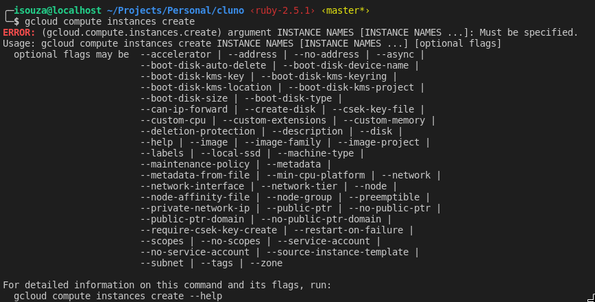
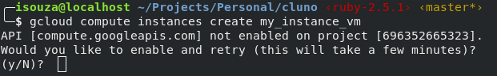
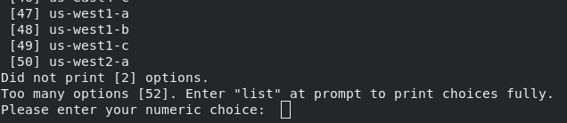
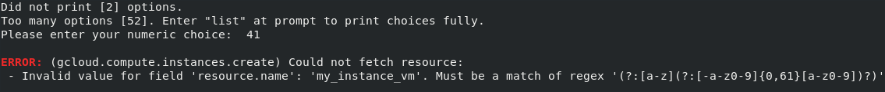
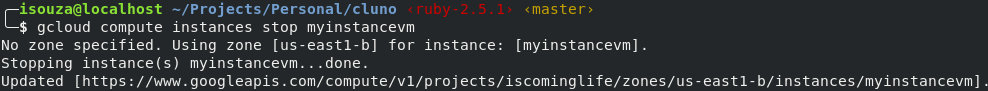
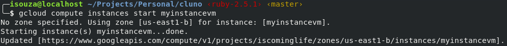
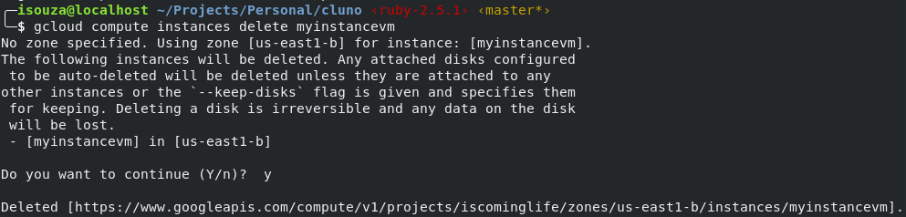

## Google Compute Engine

Agora que ja entendemos um pouco sobre como escolher qual opcao devemos utilizar no nosso projeto, vamos ver com um pouco mais de detalhes como utilizar cada uma delas.

A nossa primeira opcao vai ser a mais generica de todas, o GCE. Como combinamos no comeco desse material, vamos tentar fazer tudo utilizando o SDK do gcloud. Assim vamos pegando experiencia para quando precisarmos automatizar algum desses passos. 

### Create

Caso voce nao se lembre, ou saiba, o comando para criar instancias podemos usar o `man` para descobrir.

digite `man gcloud_` e precione TAB, vao aparecer varias opcoes. Ainda nao e suficiente para encontrarmos o comando, mas sabemos que estamos VMs ficam dentro da categoria de compute no GCP, entao:
`man gcloud_compute_` + tab

beleza, diminuimos mas nao foi o suficiente, como estamos falando de criar VMs vamos procurar por instancias que e o nome dado a VMs dentro do GCP.

`man gcloud_compute_instances_`

Opa, agora ja podemos ver a opcao correta.

`man gcloud_compute_instances_create`

Fique a vontade e leia as flags e paremetros do comando. Aqui vamos supor que voce nao quis ler o conteudo e resolveu executar o comando direto.

`gcloud compute instances create`

`gcloud compute instances create my_instance_vm`

Agora precisamos escolher um local pra subir nossa instancia, eu escolhi o 41 mas voce pode escolher a que te agradar mais.

Opa, erro... parece que nao respeitamos o regex responsavel por validar o nome da instancia.
Para resolver e bem simples, basta removermos o _ do nome.

`gcloud compute instances create myinstancevm`

!(gloud compute instances create myinstancename)[./img/gcloud-compute-instances-create-vmname-success.png]

Nossa primeira instancia esta criada, mas ainda existem muitos parametros que precisamos estudar sobre esse comando.

Por enquanto vamos ficar por aqui e mais pra frente eu volto e escrevo mais sobre o comando e suas peculiaridades.
Quem sabe rola um PR seu explicando melhor :)

### Stop

`gcloud compute instances stop myinstancevm`

### Start

`gcloud compute instances start myinstancevm`

### Delete

`gcloud compute instances delete myinstancevm`

