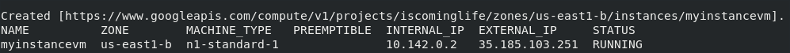

## Google Compute Engine

Agora que já entendemos um pouco sobre como escolher qual opção devemos utilizar no nosso projeto, vamos ver com um pouco mais de detalhes como utilizar cada uma delas.

A nossa primeira opção vai ser a mais genérica de todas, o GCE. Como combinamos no começo desse material, vamos tentar fazer tudo utilizando o SDK do gcloud. Assim vamos pegando experiência para quando precisarmos automatizar algum desses passos. 

### Create

Caso você não se lembre, ou saiba, o comando para criar instancias podemos usar o `man` para descobrir.

Digite `man gcloud_` e pressione TAB, vão aparecer varias opções. Ainda não e suficiente para encontrarmos o comando, mas sabemos que estamos VMs ficam dentro da categoria de compute no GCP, então:
`man gcloud_compute_` + tab

Beleza, diminuímos mas não foi o suficiente, como estamos falando de criar VMs vamos procurar por instancias que e o nome dado a VMs dentro do GCP.

`man gcloud_compute_instances_`

Opa, agora já podemos ver a opção correta.

`man gcloud_compute_instances_create`

Fique a vontade e leia as flags e parâmetros do comando. Aqui vamos supor que você não quis ler o conteúdo e resolveu executar o comando direto.

`gcloud compute instances create`

`gcloud compute instances create my_instance_vm`

Agora precisamos escolher um local pra subir nossa instancia, eu escolhi o 41, mas você pode escolher a que te agradar mais.

Opa, erro... parece que não respeitamos o regex responsável por validar o nome da instancia.
Para resolver é bem simples, basta removermos o _ do nome.

`gcloud compute instances create myinstancevm`

Nossa primeira instancia esta criada, mas ainda existem muitos parâmetros que precisamos estudar sobre esse comando.

Por enquanto vamos ficar por aqui e mais pra frente eu volto e escrevo mais sobre o comando e suas peculiaridades.
Quem sabe rola um PR seu explicando melhor :)

### Stop

`gcloud compute instances stop myinstancevm`

### Start

`gcloud compute instances start myinstancevm`

### Delete

`gcloud compute instances delete myinstancevm`

